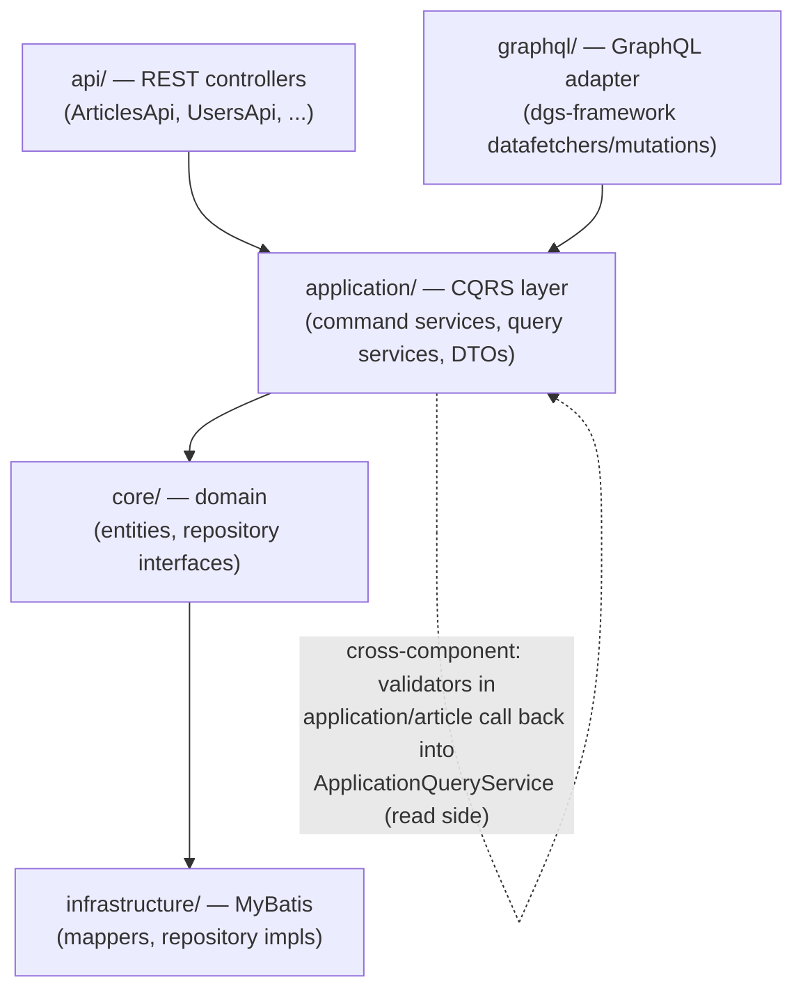

# Homework 1.2 — Codebase Exploration

**Repo:** `spring-boot-realworld-example-app` (Spring Boot 2.6.3 / Java 11, RealWorld API, DDD-ish + CQRS, MyBatis persistence, REST + GraphQL adapters over a shared core).

## Architecture sketch (3–5 components)

Both adapters (`api/`, `graphql/`) are thin — they call into the same `application/` layer, which holds command services (writes) and query services (reads, CQRS-style). `application/` depends on `core/` entities and repository *interfaces*; `infrastructure/` supplies the MyBatis-backed implementations of those interfaces plus the read-service mappers the query services use directly.

**Cross-component dependency worth flagging:** `application/article/DuplicatedArticleValidator` (a `javax.validation.ConstraintValidator` attached to `NewArticleParam.title`) is `@Autowired` with `ArticleQueryService` and calls `articleQueryService.findBySlug(...)` — i.e. request validation on the *write* path reaches into the *read* path to do its job. The same pattern repeats for `DuplicatedEmailValidator`/`DuplicatedUsernameValidator`. It works, but it means "is this a duplicate" logic isn't owned by the command service or the repository — it's owned by a Bean Validation annotation, which is an easy place to miss when reasoning about invariants.

## Data flow end-to-end: `POST /articles` (create article)

1. `ArticlesApi.createArticle` receives `@Valid @RequestBody NewArticleParam` + `@AuthenticationPrincipal User` (user already resolved by `JwtTokenFilter` earlier in the chain).
2. Bean Validation runs on `NewArticleParam`: `@NotBlank` on title/description/body, plus `@DuplicatedArticleConstraint` on `title` → `DuplicatedArticleValidator` → `ArticleQueryService.findBySlug(slug, null)` (a MyBatis read query) to reject duplicate titles. If this fails, execution never reaches the controller body (see error path below).
3. Controller calls `ArticleCommandService.createArticle(newArticleParam, user)`.
4. Command service constructs a new `core.article.Article` domain entity: generates a UUID id, derives `slug` from the title (`Article.toSlug`), de-duplicates the tag list into a `Set` before converting to `Tag` objects, stamps `createdAt`/`updatedAt`.
5. `articleRepository.save(article)` → `MyBatisArticleRepository.save`, `@Transactional`: checks `articleMapper.findById(id) == null` → since new, calls `createNew`, which upserts each tag (`findTag` else `insertTag`), inserts the article-tag relation rows, then inserts the article row itself.
6. Back in the controller, the response is **not** built from the in-memory `Article` object — it re-queries via `articleQueryService.findById(article.getId(), user).get()` to get the read-model `ArticleData` DTO (with computed fields like `favorited`/`favoritesCount`), wraps it `{"article": {...}}`, returns `200 OK`.

Notable CQRS artifact: step 6 is a read-after-write — the write path builds a domain object, persists it, then immediately re-fetches it through the query side to shape the response, rather than mapping the domain object directly.

## Error path: validation failure vs. auth failure

**Field validation (e.g. blank title on create article):**
`@Valid` fails during argument binding → Spring throws `MethodArgumentNotValidException` before the controller method body runs → caught by `CustomizeExceptionHandler.handleMethodArgumentNotValid` (an override of `ResponseEntityExceptionHandler`'s hook) → each `FieldError` mapped to a `FieldErrorResource` → wrapped in `ErrorResource` → `422 UNPROCESSABLE_ENTITY`, body shaped `{"errors": {"title": ["can't be empty"]}}`.

**Auth failure (bad login credentials):**
`UsersApi.userLogin` does *not* use `@Valid`-driven business validation for the credential check — it manually looks up the user and compares password, and on failure throws `InvalidAuthenticationException` (a plain `RuntimeException`) → caught by a *different* handler, `CustomizeExceptionHandler.handleInvalidAuthentication` → same `422` status, but a flat body `{"message": "invalid email or password"}` — no `errors` object.

Same HTTP status, two incompatible response shapes, decided by which exception type gets thrown. A client (or a new engineer adding an endpoint) has to already know this to parse errors correctly or to pick the "right" exception to throw.

## Technical debt observation

**The duplicate-title check is a TOCTOU race, and it's technical debt because the fix isn't local.** `DuplicatedArticleValidator` checks for an existing slug via a read query, but `MyBatisArticleRepository.save` re-checks existence with its own `findById` immediately before insert — there is no unique constraint in the schema (`V1__create_tables.sql`) and no locking between the two checks. Two concurrent `POST /articles` requests with the same title can both pass validation and both proceed to insert, silently violating the uniqueness invariant the validator exists to enforce. This counts as debt (not just a bug) because correcting it isn't a one-line fix in one file: it would require coordinating a DB-level unique constraint, the repository's insert-vs-update branching, and the validator's read-based check across three layers (`core`/`infrastructure`/`application`) — and the same validator pattern is duplicated for username and email, so the same class of race exists in at least three places today.
