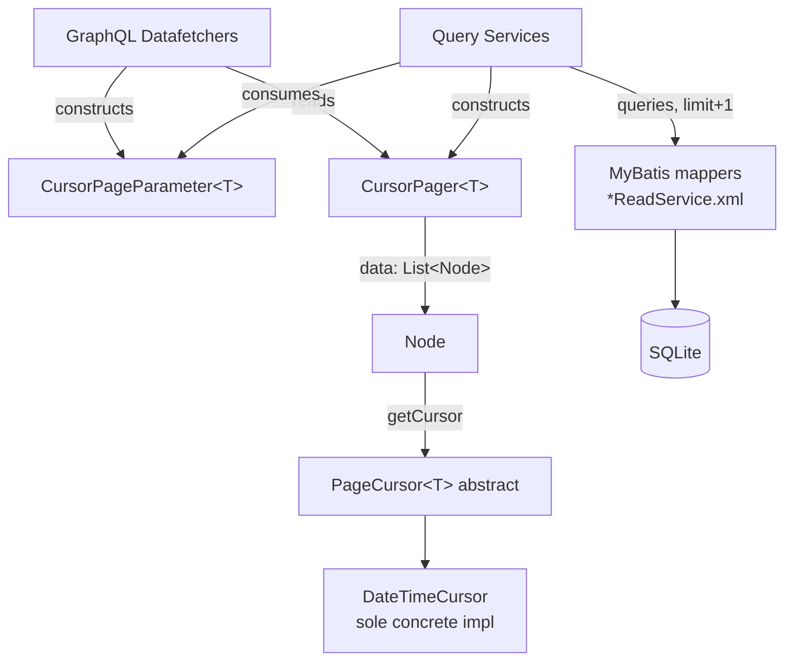

# Architecture: Cursor-Based Pagination Module

## Entry points
- GraphQL `Query.articles`, `Query.feed` (`ArticleDatafetcher`)
- GraphQL `Profile.articles`, `Profile.favorites`, `Profile.feed` (`ArticleDatafetcher`)
- GraphQL comment pagination via `CommentDatafetcher`

Each accepts Relay-style `first`/`after` or `last`/`before` arguments, constructs a `CursorPageParameter`, and reads back a `CursorPager`.

## Components
- `Node` (interface) — contract for any paginated read-model: `getCursor(): PageCursor`
- `PageCursor<T>` (abstract) — opaque cursor wrapper (`getData()`, `toString()`)
- `DateTimeCursor extends PageCursor<DateTime>` — sole concrete cursor; encodes/decodes as epoch-millis string
- `CursorPageParameter<T>` (request) — cursor, limit (default 20, max 1000), direction (NEXT/PREV); `getQueryLimit()` = limit + 1 (`CursorPageParameter.java:25-27`)
- `CursorPager<T extends Node>` (result) — data, `hasNext`/`hasPrevious` derived from a single `hasExtra` flag + direction (`CursorPager.java:12-22`)

## Data flow (NEXT, single-query path — e.g. `findUserFeedWithCursor`)
GraphQL request (first, after) → `DateTimeCursor.parse(after)` + `new CursorPageParameter<>(cursor, first, NEXT)` → query service → mapper: `WHERE created_at < cursor ORDER BY created_at desc LIMIT queryLimit` → `hasExtra = resultSize > limit`, trim if true → `new CursorPager<>(data, direction, hasExtra)` → GraphQL `PageInfo`(hasNextPage/hasPreviousPage) + edges.

PREV mirrors this with `>` / `asc`, then `Collections.reverse()` restores newest-first order — for the single-query paths only (`ArticleQueryService.java` `findUserFeedWithCursor`, `CommentQueryService` `findByArticleIdWithCursor`). The two-phase path (`ArticleQueryService.findRecentArticlesWithCursor`, lines 54-78: fetch IDs → re-fetch full rows by ID) instead relies on the re-fetch query's own unconditional `ORDER BY created_at desc` (`ArticleReadService.xml:85-92`).

## External dependencies
- Joda-Time (`DateTime`) — `DateTimeCursor`'s only concrete representation
- Lombok (`@Getter`, `@Data`) — `CursorPageParameter`'s `setCursor`/`setLimit` explicitly redeclared private to enforce clamping
- MyBatis — binds `CursorPageParameter`'s cursor field by runtime type, not declared generic
- graphql.relay (Netflix DGS) — consumes `CursorPager`'s output as a Relay Connection/PageInfo (adapter-side)

## Implicit assumptions
1. **No compiler-enforced link between the cursor type produced and the cursor type consumed.** `PageCursor` (`PageCursor.java:3-18`) is abstract with a single concrete subclass, `DateTimeCursor`. `Node.getCursor()` and `CursorPager.getStartCursor()/getEndCursor()` (`CursorPager.java:32-38`) return the raw abstract `PageCursor`; `CursorPageParameter<T>`'s `T` has no generic relationship to it. Holds together purely by convention today — a second cursor type would compile against a mismatched read-model and fail only at runtime.
2. **The "fetch limit+1, then trim" contract is manual, repeated at every call site, not enforced by the types.** `getQueryLimit()` (`CursorPageParameter.java:25-27`) and `hasExtra` are independent values; each caller must query with `queryLimit`, compute `hasExtra` from the pre-trim size against `limit`, then trim — in that order (e.g. `ArticleQueryService.java:65-68`). Comparing against the wrong count makes `hasNext()`/`hasPrevious()` permanently false, or throws `IndexOutOfBoundsException` on trim.
3. **Millisecond-resolution timestamps are assumed unique and totally ordered, with no tie-breaker.** Cursor queries filter/order purely on `created_at`/`updated_at` (`ArticleReadService.xml:119-131`: `AND created_at < #{page.cursor}` / `order by created_at desc|asc`, no secondary key). Two rows sharing an exact millisecond at a page boundary causes one to be silently and permanently skipped — no error, no duplicate.
4. **`Collections.reverse(articleIds)` in the two-phase path (`ArticleQueryService.java:70`) assumes it restores correct row order for PREV pages — it doesn't.** The subsequent `findArticles(articleIds)` re-fetch (`ArticleReadService.xml:85-92`) has its own unconditional `order by A.created_at desc`, which fully determines output order regardless of the input ID list's order. Verified directly against the mapper XML: dead code on every PREV-direction two-phase page.

## Open questions (not answerable from the code alone)
- Why two structurally different query paths exist for the same conceptual operation (single-query-with-reverse vs. two-phase fetch-then-refetch) — historical reason, not visible in the code.
- Whether millisecond-collision (#3) is a live, observed risk given this system's actual write patterns, or purely theoretical.
